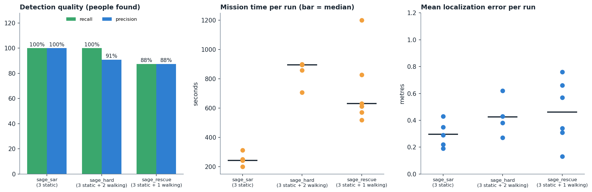

# SAGE-UAV

**Semantic AI-Guided Exploration and Active Search for autonomous UAVs**

An autonomous quadrotor that understands a mission such as *"Find all people in this area and report their locations"*, searches the area, detects people with YOLO, localizes them in 3D, keeps a semantic world model, verifies every finding with repeated observations, watches its battery, and returns home and lands by itself. ROS 2 Humble, PX4 SITL and Gazebo.

## What it does

| stage | how |
|---|---|
| Mission understanding | rule-based parser (default, keyless) or Claude LLM front end; free text -> validated JSON spec |
| Perception | onboard camera + YOLO person detector (5 Hz) |
| 3D localization | image ray + delayed PX4 pose/attitude -> ground position (about 0.3 m median error) |
| Semantic memory | tracks with motion state, duplicate merging, persistent IDs |
| Active search | serpentine coverage sweep with a 360 degree scan per waypoint; candidate viewpoints; evidence accumulation before a person is "verified" |
| Safety | every planner viewpoint is validated (obstacle map, step limit, altitude); energy monitor triggers return-home; UAV-lost guard; PX4 offboard-loss failsafe |
| Report | JSON: who was found, where, when, how confident |

## Results (simulation)

| world | runs | people found | precision | mean error | mission time (median) |
|---|---|---|---|---|---|
| `sage_sar` - 3 standing people | 5 | 100% | 100% | 0.30 m | 242 s |
| `sage_rescue` - rich scene, 3 standing + 1 walking | 6 | 88% | 88% | 0.46 m | 630 s |
| `sage_hard` - 3 standing + 2 walking, obstacles | 4 | 100% | 91% | 0.43 m | 895 s |

The walking person is the open problem (reported twice in some runs). Details: `docs/results.md`, `results/summary.md`,
`docs/progress.md` (full log), `docs/limitations.md` (read this before quoting numbers). Demo (same flight, two views): `demo/sage_uav_camera_view.mp4` and `demo/sage_uav_gazebo_overhead.mp4`.

## Layout

- `src/sage_px4_interface/` ROS 2 package: all nodes, unit tests in `test/`
- `worlds/` Gazebo worlds (`sage_sar`, `sage_hard`, `sage_hard_long`, `sage_rescue`) and `make_worlds.py`; `config/` per-world truth, area and obstacle map
- `scripts/` `stack.sh` (full restart), `stack_verified.sh` (health-gated start), `run_trials.sh` (repeat + score), `score_trial.py`, `record_raw.py` + `render_demo.py` (demo videos), `make_figures.py`, `make_collage.py`
- `docs/` roadmap, progress log, design notes, limitations
- `results/` trial tables, saved logs, figures, demo

## Run

1. PX4 SITL (`gz_x500_mono_cam`), Micro XRCE-DDS agent on UDP 8888, ROS 2 Humble, `px4_msgs` v1.16 in the same workspace.
2. `colcon build --packages-select sage_px4_interface`
3. Copy `worlds/*.sdf` to `PX4-Autopilot/Tools/simulation/gz/worlds/`.
4. `SAGE_WORLD=sage_rescue scripts/stack_verified.sh 1800` then `SAGE_WORLD=sage_rescue scripts/start_mission_nodes.sh`
5. `ros2 topic pub --once /sage/mission/command std_msgs/msg/String "{data: 'Find all people in this area and report their locations'}"`
6. Film it: `python3 scripts/record_demo.py --world sage_rescue --out results/demo/run1` (before step 5), or `SAGE_RECORD=1 scripts/run_trials.sh 3 sage_rescue`.

## Mission understanding (optional LLM)

The parser uses the Claude API when `ANTHROPIC_API_KEY` is set and falls back to the rule-based parser otherwise. The key is never stored in the repository. `SAGE_LLM_MODEL` overrides the model.

## Honest limitations

Simulation only. Localization uses a tuned camera delay; people are animated actors; obstacle avoidance uses a known map; only the `person` class is detected; walking people can be reported twice in the hard world. Details and numbers: `docs/limitations.md`.
