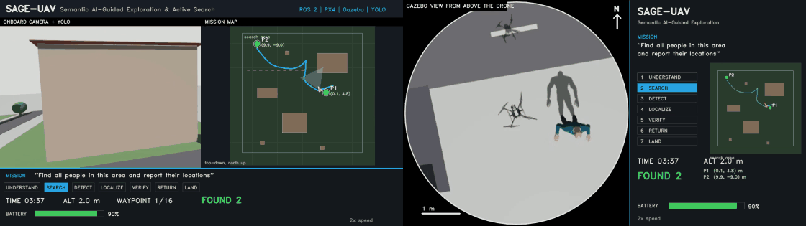
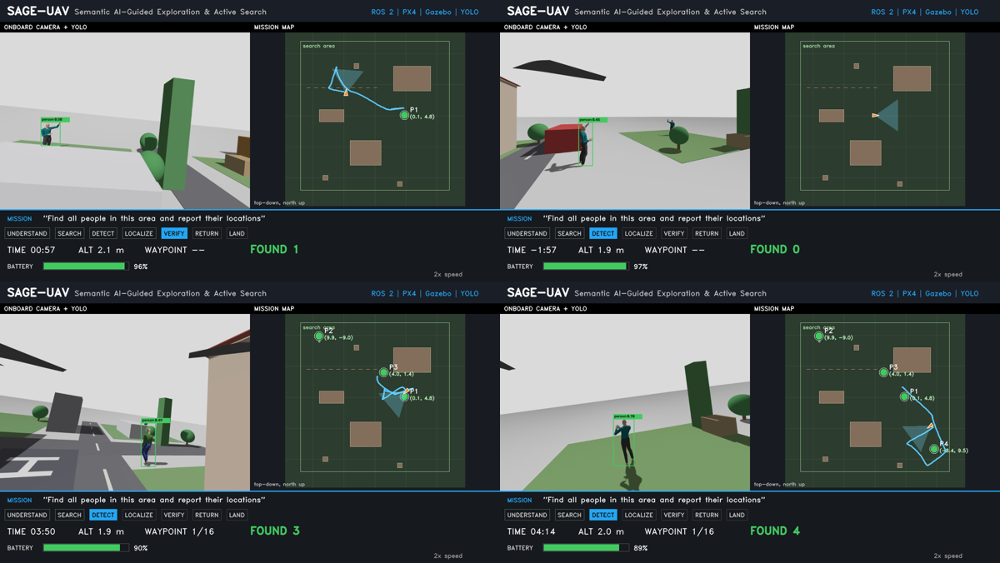

<div align="center">

# 🛰️ SAGE-UAV

### Semantic AI-Guided Exploration & Active Search for autonomous drones

**Type one sentence. The drone finds the people, tells you where they are, and lands itself.**




<sub>Left: onboard camera with YOLO detections and the live mission map. Right: Gazebo view from a camera mounted above the drone.
Same flight, 2x real speed. Full videos: <a href="demo/sage_uav_camera_view.mp4">camera view</a> · <a href="demo/sage_uav_drone_top_view.mp4">drone top view</a>.</sub>

</div>

---

## Contents

[What it does](#-what-it-does) · [Demo](#-demo) · [Results](#-results) · [Requirements](#-requirements) · [Installation](#-installation) ·
[Run a mission](#-run-a-mission) · [Mission language](#-mission-language) · [Worlds](#-worlds) · [Configuration](#-configuration) ·
[Outputs](#-outputs) · [Evaluate](#-evaluate-repeat-and-score) · [Film a flight](#-film-a-flight) · [Tests](#-tests) ·
[Troubleshooting](#-troubleshooting) · [Repository map](#-repository-map) · [Documentation](#-documentation) · [Roadmap](#-roadmap) ·
[Cite](#-cite) · [License](#-license)

---

## ✨ What it does

```text
"Find all people in this area and report their locations"
        │
        ▼
 understand ─▶ search ─▶ detect ─▶ localize in 3D ─▶ remember ─▶ verify ─▶ report ─▶ return ─▶ land
```

SAGE-UAV is a complete autonomy stack for a quadrotor, built and evaluated in simulation (ROS 2 Humble, PX4 SITL, Gazebo):

| stage | what happens |
|---|---|
| **Mission understanding** | Free text becomes a validated JSON spec. A rule-based parser works offline; an optional Claude front end can fill the same fields. Unsupported requests (for example "red vehicles") are rejected with a reason. |
| **Perception** | Onboard camera + YOLO person detector (5 Hz). |
| **3D localization** | Image ray + time-aligned PX4 pose and attitude give a ground position, about **0.3 m** median error. |
| **Semantic memory** | Tracks with motion state and persistent IDs; fragmented and duplicate tracks are merged. |
| **Active search** | Serpentine coverage sweep with a 360° scan at every waypoint; a candidate is re-observed until it accumulates enough live evidence to count as a person. |
| **Safety** | Every viewpoint is validated (obstacle map, step limit, altitude); an energy monitor triggers return-home; a UAV-lost guard ends the mission if the drone leaves the area; PX4 holds on offboard loss. |
| **Report** | JSON with every person found, position, confidence, and mission time. |

<div align="center">

</div>

---

## 🎥 Demo

<div align="center">

<br><sub>Search, first detection, and verified people from the demo flight (4 of 4 found, no false reports, 706 s).</sub>
</div>

Two videos of the same flight (6 min 07 s each, 2x speed): [`demo/sage_uav_camera_view.mp4`](demo/sage_uav_camera_view.mp4) and
[`demo/sage_uav_drone_top_view.mp4`](demo/sage_uav_drone_top_view.mp4). The scene is a small town (roads, houses, trees, cars, a helipad) with
three standing people and one person walking a 12 m path.

---

## 📊 Results

Simulation, scored automatically against ground truth (details: [`docs/results.md`](docs/results.md), [`docs/EVALUATION.md`](docs/EVALUATION.md)).

| world | runs | people found | precision | mean position error | mission time (median) |
|---|---|---|---|---|---|
| `sage_sar`: 3 standing people | 5 | **100%** | **100%** | **0.30 m** | 242 s |
| `sage_rescue`: 3 standing + 1 walking, town scene | 7 | 89% | 89% | 0.46 m | 630 s |
| `sage_hard`: 3 standing + 2 walking, obstacles | 4 | 100% | 91% | 0.43 m | 895 s |

<div align="center"></div>

Standing people are located reliably; a person walking through the scene is found in most runs and occasionally reported at two points on its path.

---

## 🧰 Requirements

| | |
|---|---|
| OS | Ubuntu 22.04 |
| Hardware | 4 CPU cores and 8 GB RAM are enough (tested on 4 cores / 7 GB, **no GPU**); about 10 GB free disk for PX4 and the build |
| Software | ROS 2 Humble, Gazebo Harmonic (Sim 8), PX4-Autopilot **v1.16.0**, Micro XRCE-DDS Agent **v2.4.3**, `px4_msgs` **v1.16.2**, Python 3.10 |
| Python packages | `ultralytics` (YOLO), CPU PyTorch, OpenCV, NumPy 1.26: pinned in [`environment/requirements-vision.txt`](environment/requirements-vision.txt) |

Exact versions, PX4 patches and package lists: [`environment/README.md`](environment/README.md).

---

## 🚀 Installation

The scripts expect these locations: `~/SAGE-UAV`, `~/PX4-Autopilot`, `~/Micro-XRCE-DDS-Agent`, `~/sage_ws`, `~/sage_vision_env`. Follow the steps in order.

**1. Get the code**
```bash
git clone https://github.com/haidar996/SAGE-UAV.git ~/SAGE-UAV
```

**2. ROS 2 Humble and the Gazebo bridge**
```bash
sudo apt update
sudo apt install ros-humble-desktop ros-humble-ros-gzharmonic ros-humble-vision-msgs ros-humble-cv-bridge \
     ros-humble-image-transport-plugins python3-colcon-common-extensions python3-vcstool
```

**3. PX4 v1.16.0 (SITL) with the SAGE worlds and drone model**
```bash
git clone https://github.com/PX4/PX4-Autopilot.git --recursive ~/PX4-Autopilot
cd ~/PX4-Autopilot && git checkout v1.16.0 && git submodule update --init --recursive
bash ./Tools/setup/ubuntu.sh            # PX4 dependencies (asks for sudo), then log out/in if it says so
make px4_sitl_default                    # builds the SITL binary
~/SAGE-UAV/environment/patch_px4.sh      # installs worlds/*.sdf and the drone model with the extra camera link
```

**4. Micro XRCE-DDS Agent v2.4.3** (the bridge between PX4 and ROS 2)
```bash
git clone --branch v2.4.3 https://github.com/eProsima/Micro-XRCE-DDS-Agent.git ~/Micro-XRCE-DDS-Agent
mkdir -p ~/Micro-XRCE-DDS-Agent/build && cd ~/Micro-XRCE-DDS-Agent/build && cmake .. && make -j2
```

**5. ROS workspace** (clones `px4_msgs` v1.16.2, links this repo's package, builds both)
```bash
~/SAGE-UAV/environment/setup_workspace.sh
```

**6. Vision environment for YOLO**
```bash
python3 -m venv ~/sage_vision_env
~/sage_vision_env/bin/pip install --extra-index-url https://download.pytorch.org/whl/cpu \
    -r ~/SAGE-UAV/environment/requirements-vision.txt
cp ~/SAGE-UAV/models/yolo/yolo26n.pt ~/sage_ws/          # the weights are loaded by file name (already in the repo)
```
The YOLO launcher's first line points at `/home/haidar/sage_vision_env/bin/python`; if your home directory differs, edit line 1 of
`src/sage_px4_interface/sage_px4_interface/yolo_detector_launcher.py` and rebuild (`colcon build --packages-select sage_px4_interface`).

**7. Check the installation**
```bash
cd ~/SAGE-UAV/src/sage_px4_interface && source /opt/ros/humble/setup.bash
PYTHONPATH=. python3 -m pytest test/test_mission_parser.py test/test_mission_llm.py test/test_obstacle_map.py test/test_identity_resolution.py -q   # 29 passed
```

---

## ▶️ Run a mission

Open a terminal (all commands from `~/SAGE-UAV`; ROS is sourced by the scripts).

```bash
# 1. Start the simulation stack: PX4 + Gazebo (headless) + XRCE agent + camera bridges + YOLO + localizer + world model + energy monitor.
#    The script waits until the drone hovers near the origin and the simulator runs near real time, and retries up to 5 times (about 5 min).
SAGE_WORLD=sage_rescue scripts/stack_verified.sh 1800

# 2. Start the mission nodes: parser, safety manager, planner (reads config/sage_rescue.env for the search area and obstacles).
SAGE_WORLD=sage_rescue scripts/start_mission_nodes.sh

# 3. Give the mission.
source /opt/ros/humble/setup.bash && source ~/sage_ws/install/setup.bash
ros2 topic pub --once /sage/mission/command std_msgs/msg/String \
  "{data: 'Find all people in this area and report their locations'}"
```

**Watch it.** `tail -f /tmp/sage_logs/planner.log` shows the mission: `MISSION ACCEPTED`, `COVERAGE WAYPOINT 3/16`, `TARGET VERIFIED | id=1 | position=(0.1, 4.8)`,
`MISSION COMPLETE | status=area_covered | found=4 ...`, then `RETURN HOME`, `HOME REACHED`, landing and disarm. Other logs: `mission.log` (safety checks),
`offboard.log` (flight commands), `energy.log` (battery), `yolo.log`, `localizer.log`, `world.log`.
Read the report: `ros2 topic echo /sage/mission/report` (published once when the mission ends, so start it before then), or read the `MISSION COMPLETE` line in `planner.log`, which lists every location.

**Stop everything:** `scripts/killall.sh`. A full mission takes about 8-12 minutes.

To see Gazebo's window set `SAGE_GUI=1` before step 1 (it slows the simulation; use it only to look around).

---

## 💬 Mission language

| you say | what happens |
|---|---|
| `Find all people in this area and report their locations` | searches the whole area, reports every person (`quantity: all`, `output: locations`) |
| `Find 2 people and report their location` | ends as soon as 2 people are verified |
| `Find all people and count them` | `output: count` |
| `Find all red vehicles` | understood but **rejected with a reason**: only `person` is detected |

The rule-based parser needs no network. If the environment variable `ANTHROPIC_API_KEY` is set, a Claude front end fills the same fields first and
falls back to the rules on any error (choose the model with `SAGE_LLM_MODEL`; disable with the parser parameter `use_llm:=false`). The key is only
read from the environment and is never stored.

---

## 🗺️ Worlds

| world | scene | people |
|---|---|---|
| `sage_rescue` | small town: roads, houses, wall, trees, cars, helipad (**main and demo world**) | 3 standing + 1 walking |
| `sage_sar` | open ground, baseline | 3 standing |
| `sage_hard` | 24 × 24 m with buildings, wall, trees | 3 standing + 2 walking |
| `sage_hard_long` | as `sage_hard`, longer walker paths | 3 standing + 2 walking |

Choose a world with `SAGE_WORLD=<name>`. Worlds, their ground truth (`config/truth_<world>.json`) and settings (`config/<world>.env`) are generated by
`python3 worlds/make_worlds.py`; copy new `.sdf` files into PX4 with `environment/patch_px4.sh`. More: [`docs/WORLDS.md`](docs/WORLDS.md).

---

## ⚙️ Configuration

**Environment variables**

| variable | meaning | default |
|---|---|---|
| `SAGE_WORLD` | world name (must match a file in `worlds/`) | `sage_test` |
| `SAGE_YOLO_HZ` | detector rate; higher rates starve the simulator on one CPU | `5` |
| `SAGE_GUI` | `1` shows the Gazebo window | off |
| `SAGE_RECORD` | `1` enables the light flight logger and annotated frames (see [Film a flight](#-film-a-flight)) | off |
| `ATT` | localizer attitude source: `px4` or `gz_truth` (evaluation only) | `px4` |
| `ANTHROPIC_API_KEY`, `SAGE_LLM_MODEL` | optional LLM mission parser | unset |

**Key ROS parameters** (set with `--ros-args -p name:=value`; the world `.env` file passes the area and obstacles automatically)

| parameter | node | default |
|---|---|---|
| `area` `[north_min, north_max, east_min, east_max]` | planner | world file |
| `coverage_spacing`, `scan_yaw_rate_deg` | planner | 6 m, 45°/s |
| `candidate_timeout_s`, `mission_timeout_s` | planner | 25 s, 1200 s |
| `obstacles`, `obstacle_margin` | planner, manager | world file, 2.5 m (`sage_rescue`) |
| `energy_aware` | planner | true |
| `reserve_fraction` | energy monitor | 0.20 |
| `pose_delay_s`, `px4_height_offset_m`, `max_tilt_deg` | localizer | 0.6 s, −0.3 m, 8° |
| `use_llm` | parser | true (falls back to rules) |

Every threshold and the full parameter list: [`docs/ARCHITECTURE.md`](docs/ARCHITECTURE.md).

---

## 📤 Outputs

**Mission report** (`/sage/mission/report`, JSON, published once at the end):
```json
{
  "mission": "Find all people in this area and report their locations",
  "status": "area_covered",
  "count": 4,
  "found": [
    {"id": 1,  "x": 0.1,  "y": 4.8,  "confidence": 0.81},
    {"id": 3,  "x": -8.4, "y": 9.5,  "confidence": 0.79},
    {"id": 6,  "x": 4.0,  "y": 1.4,  "confidence": 0.77},
    {"id": 10, "x": 9.9,  "y": -9.0, "confidence": 0.84}
  ],
  "duration_s": 706.0
}
```
Positions are `(x = north, y = east)` metres from the takeoff point. `status` is `area_covered`, `quantity_reached`, `timeout`, `energy_abort` or `uav_lost`.

**Files:** live logs in `/tmp/sage_logs/`; trial runs are archived in `results/logs/<run id>/` with one scored row per run in `results/trials_<world>.csv`.

---

## 📐 Evaluate: repeat and score

```bash
scripts/run_trials.sh 5 sage_rescue          # 5 complete missions: start stack, fly, save all logs, score against ground truth
python3 scripts/make_figures.py              # results/summary.md and results/figures/*.png from results/trials_*.csv
python3 scripts/score_trial.py results/logs/<run id>/planner.log sage_rescue      # score a single run
```
A report counts as correct if it lies within 1.5 m of a standing person or of a walking person's path; each true person is matched once. Columns:
`trial, date, world, status, found, tp, fp, fn, mean_err_m, max_err_m, duration_s, rejected_candidates`. Keep the machine otherwise idle while trials run.

---

## 🎬 Film a flight

```bash
SAGE_RECORD=1 scripts/run_trials.sh 1 sage_rescue                     # one flight; a light logger saves frames + poses to results/raw/<run id>/
python3 scripts/render_demo.py results/raw/<run id> \
    --planner-log results/logs/<run id>/planner.log --speed 2         # renders demo_camera.mp4 and demo_overhead.mp4 in that folder
python3 scripts/make_collage.py results/raw/<run id> demo/pictures    # pictures
```
The renderer runs after the flight so the simulator is not slowed; both videos are web-optimised (H.264, index first). The drone-top view comes from a
camera link added to the drone model by `environment/patch_px4.sh`.

---

## ✅ Tests

```bash
cd src/sage_px4_interface && source /opt/ros/humble/setup.bash
PYTHONPATH=. python3 -m pytest test/test_mission_parser.py test/test_mission_llm.py test/test_obstacle_map.py test/test_identity_resolution.py -q
```
29 unit tests for the pure decision logic (mission parsing, LLM field validation, obstacle routing, identity resolution); no simulator required.

---

## 🩺 Troubleshooting

| symptom | what to do |
|---|---|
| `stack_verified.sh` prints `healthy=no` and retries | it checks the simulator speed (real-time factor above 0.5) and hover position; close other heavy programs and wait for the retry (up to 5) |
| arming denied / "No connection to ground control station" | `scripts/stack.sh` already relaxes these SITL checks; rerun the stack script instead of starting PX4 by hand |
| YOLO node fails to start | check `~/sage_vision_env` exists, `~/sage_ws/yolo26n.pt` is present, and the first line of `yolo_detector_launcher.py` points at your venv |
| no `/fmu/...` topics | the XRCE agent is not running (`scripts/stack.sh` starts it from `~/Micro-XRCE-DDS-Agent/build`) |
| leftovers from a previous run | `scripts/killall.sh`, then start again |
| a video will not play in a browser | run `python3 scripts/tools/faststart.py file.mp4` (moves the MP4 index to the front); rendered videos already have it |

---

## 🗂️ Repository map

| path | contents |
|---|---|
| `src/sage_px4_interface/` | the ROS 2 package: nodes, mission parser, planner, unit tests |
| `worlds/`, `config/`, `models/` | Gazebo worlds and their generator, per-world truth/area/obstacle files, drone model, YOLO weights |
| `scripts/` | stack start, trial runner, scoring, video recorder/renderer, figure generation, tools |
| `environment/` | pinned versions, PX4 patches, workspace and vision-env setup, package lists |
| `results/` | trial tables, saved logs, figures |
| `demo/` | the two demo videos, pictures, post text ([details](demo/README.md)) |
| `docs/` | [index](docs/README.md): specification, architecture, usage, worlds, evaluation, roadmap, design notes, engineering log |

## 📚 Documentation

[Specification](docs/PROJECT_SPECIFICATION.md) · [Architecture](docs/ARCHITECTURE.md) · [Usage](docs/USAGE.md) · [Worlds](docs/WORLDS.md) ·
[Evaluation](docs/EVALUATION.md) · [Results](docs/results.md) · [Scope](docs/SCOPE.md) · [Roadmap](docs/ROADMAP.md) ·
[Environment](environment/README.md) · [Contributing](CONTRIBUTING.md) · [Changelog](CHANGELOG.md)

## 🛣️ Roadmap

Active identity check for walking people · shorter missions · controlled experiments (random vs intelligent search, energy-aware planning) ·
hardware-in-the-loop. Details: [`docs/ROADMAP.md`](docs/ROADMAP.md).

## ℹ️ Scope

Simulation research system (PX4 SITL + Gazebo, `person` class, known static obstacles). Assumptions: [`docs/SCOPE.md`](docs/SCOPE.md).

## 📖 Cite

See [`CITATION.cff`](CITATION.cff) (GitHub shows a "Cite this repository" button).

## 🙏 Acknowledgements

Built on [PX4](https://px4.io), [Gazebo](https://gazebosim.org), [ROS 2](https://docs.ros.org), [Micro XRCE-DDS](https://github.com/eProsima/Micro-XRCE-DDS-Agent)
and [Ultralytics YOLO](https://github.com/ultralytics/ultralytics) (weights: AGPL-3.0).

## 📄 License

MIT, see [`LICENSE`](LICENSE).
