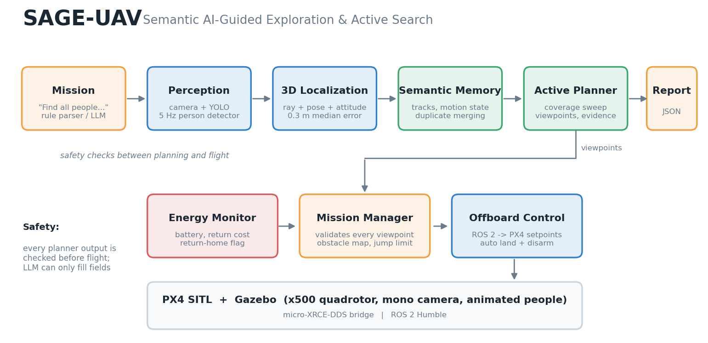

# Architecture



## Data flow
```text
/sage/mission/command  (String, free text)
   └─ sage_mission_parser ──────────────► /sage/mission/spec  (JSON, latched)
camera ─ ros_gz_bridge ─ yolo_detector ─► /sage/perception/detections  (Detection2DArray)
                                            └─ sage_target_localizer ─► /sage/perception/target_position
                                                                          └─ sage_semantic_world_model ─► /sage/world_model/targets
/sage/world_model/targets ─┐
/sage/mission/spec ────────┼─ sage_viewpoint_planner ─► /sage/planning/viewpoint ─► sage_mission_manager
/sage/energy/status ───────┘        │                                                  │ (safety checks)
                                    └─► /sage/mission/report (JSON)                    ▼
sage_energy_monitor ─► /sage/energy/{status,return_home}               /sage/mission/validated_viewpoint
                                                                                        ▼
                                                                          offboard_position_node ─► /fmu/in/* ─► PX4
```

## Nodes
| node | role | main inputs | main outputs |
|---|---|---|---|
| `yolo_detector` | YOLO person detector, CPU, capped at 5 Hz (`SAGE_YOLO_HZ`); optional annotated JPEG stream for filming (`SAGE_YOLO_ANNOTATE=1`) | camera image | `/sage/perception/detections` |
| `sage_target_localizer` | casts the bounding-box anchor as a ray, rotates it with the attitude, intersects the ground plane; pose and attitude are looked up at the frame time minus `pose_delay_s` | detections, `/fmu/out/vehicle_local_position`, `/fmu/out/vehicle_attitude` | `/sage/perception/target_position` |
| `sage_semantic_world_model` | associates positions to tracks (gate 2 m), smooths, classifies motion, publishes persistent tracks | target positions | `/sage/world_model/targets` |
| `sage_viewpoint_planner` | mission state machine: coverage sweep, candidate handling, evidence accumulation, energy-aware viewpoint choice, completion and report | tracks, spec, detections, energy | `/sage/planning/viewpoint`, `/sage/mission/report`, `/sage/mission/return_home` |
| `sage_mission_manager` | independent safety gate for every viewpoint | planner viewpoints, UAV position | `/sage/mission/validated_viewpoint`, `/sage/mission/land_request` |
| `sage_energy_monitor` | battery drain rate, return time and cost, return-home flag | `/fmu/out/battery_status` | `/sage/energy/status`, `/sage/energy/return_home` |
| `offboard_position_node` | arms, requests offboard mode, streams setpoints, lands and disarms | validated viewpoints, land requests | `/fmu/in/offboard_control_mode`, `/fmu/in/trajectory_setpoint`, `/fmu/in/vehicle_command` |
| `sage_mission_parser` | text to spec; rule-based, optional LLM (`use_llm`) | `/sage/mission/command` | `/sage/mission/spec` |

## Coordinate conventions
PX4 local frame NED (x north, y east, z down). All positions in reports are `(north, east)` metres from the takeoff point. Flight altitude is 2 m
(`z = -2`). The camera is mounted at (0.12, 0.03, 0.242) m in the body frame.

## Mission spec and report
```json
{"text": "Find all people in this area and report their locations", "action": "find", "target_class": "person",
 "attribute": null, "quantity": "all", "output": "locations", "valid": true, "supported": true, "reason": ""}
```
```json
{"mission": "...", "status": "area_covered", "count": 4,
 "found": [{"id": 1, "x": 0.1, "y": 4.8, "confidence": 0.81, "viewpoint": 1, "moving": false, "speed": 0.05}],
 "duration_s": 706.0}
```
`status` is one of `area_covered`, `quantity_reached`, `timeout`, `energy_abort`, `uav_lost`.

## Search and verification (planner)
1. **Coverage sweep.** Serpentine waypoints over the search area (`area`, `coverage_spacing` 6 m); at each waypoint the drone rotates 360° at
   `scan_yaw_rate_deg` (45°/s).
2. **Candidate.** A tracked person inside the area that is not already verified becomes a candidate; the planner leaves the sweep and observes it.
3. **Evidence.** An observation counts when confidence ≥ 0.6, the box covers ≥ 1% of the image, it is at least 0.02 of the image size away from the
   border, and the live localization lies within 2 m of the track. 2 s of evidence (11 points) verifies the person; the verified position is the mean
   of the evidence.
4. **Duplicates.** A verification within 2.5 m of an earlier one is merged (moving people use a growing radius).
5. **Completion.** `all`: after the last waypoint (`area_covered`); integer quantity: when reached. Then return home and land.

## Safety layers
| layer | check |
|---|---|
| mission manager | finite position and orientation, altitude 1-5 m above ground, ≤ 8 m from the UAV, jump ≤ 3 m from the last accepted viewpoint (reset after 3 s), viewpoint age ≤ 1 s, not inside the inflated obstacle map |
| obstacle map | rectangles inflated by `obstacle_margin` (2.5 m in `sage_rescue`); visibility-graph detours around them |
| energy monitor | return-home flag when `remaining − drain·return_time < reserve` (reserve 20%) |
| UAV-lost guard | mission ends with the partial report if the UAV is > 6 m outside the area or on the ground for 8 s |
| PX4 | offboard-loss failsafe = Hold (`COM_OF_LOSS_T` 2 s, `COM_OBL_RC_ACT` 5) |

## Key parameters
| parameter | node | default |
|---|---|---|
| `area` `[n0,n1,e0,e1]`, `coverage_spacing`, `scan_yaw_rate_deg` | planner | ±9 m, 6 m, 45°/s (world files override the area) |
| `candidate_timeout_s`, `mission_timeout_s` | planner | 25 s, 1200 s |
| `obstacles`, `obstacle_margin` | planner, manager | from `config/<world>.env` |
| `energy_aware` | planner | true |
| `reserve_fraction` | energy monitor | 0.20 |
| `pose_delay_s`, `px4_height_offset_m`, `max_tilt_deg`, `attitude_source` | localizer | 0.6 s, −0.3 m, 8°, `px4` |
| `use_llm` | parser | true (falls back to rules) |
