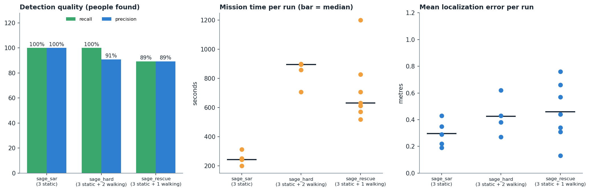

# Results (simulation)

Numbers come from the trial tables in `results/trials_*.csv`, scored automatically against ground truth (`scripts/score_trial.py`, tolerance 1.5 m;
a walking person counts if the report lies within 1.5 m of its path). Protocol: [`EVALUATION.md`](EVALUATION.md). Assumptions: [`SCOPE.md`](SCOPE.md).

| world | runs | recall | precision | false reports | mean error | mission time, median (range) |
|---|---|---|---|---|---|---|
| `sage_sar`, 3 standing people | 5 | 100% (15/15) | 100% | 0 | 0.30 m | 242 s (199-311 s) |
| `sage_rescue`, 3 standing + 1 walking, town scene | 7 | 89% (25/28) | 89% | 3 | 0.46 m | 630 s (518-1200 s) |
| `sage_hard`, 3 standing + 2 walking, obstacles | 4 | 100% (20/20) | 91% | 2 | 0.43 m | 895 s (707-900 s) |

## `sage_rescue` runs
| run | found | correct | false | missed | mean error | time | note |
|---|---|---|---|---|---|---|---|
| 0925_062308 | 3 | 2 | 1 | 2 | 0.66 m | 630 s | |
| 0925_063805 | 5 | 4 | 1 | 0 | 0.34 m | 570 s | walker reported twice |
| 0925_065952 | 5 | 4 | 1 | 0 | 0.13 m | 518 s | walker reported twice |
| 0925_071213 | 4 | 4 | 0 | 0 | 0.31 m | 1200 s | ended at the mission time limit |
| 0925_073827 | 3 | 3 | 0 | 1 | 0.76 m | 827 s | |
| 0925_141115 | 4 | 4 | 0 | 0 | 0.57 m | 611 s | earlier demo flight |
| **0925_180639** | **4** | **4** | **0** | **0** | **0.44 m** | **706 s** | **demo flight (both videos)** |

## Observations
- Standing people are located within about 0.1-0.6 m in good runs; the position error of a person in view comes mostly from the camera-to-pose timing.
- The walking person is the harder target: it is found in most runs, and occasionally reported at two points along its path. The designed fix
  ([`design/identity_check.md`](design/identity_check.md)) re-observes an earlier position to decide whether it is the same person.
- Mission time is dominated by the coverage sweep plus the time spent confirming candidates (25 s limit each).
- Two additional flights of an earlier camera configuration ended with the UAV leaving the area (`uav_lost`); they are not in the table. The
  configuration was changed and the guard added (`ARCHITECTURE.md`, safety layers).

## Demo
Two videos of flight `0925_180639` (camera view and drone top view) are described in [`../demo/README.md`](../demo/README.md).
